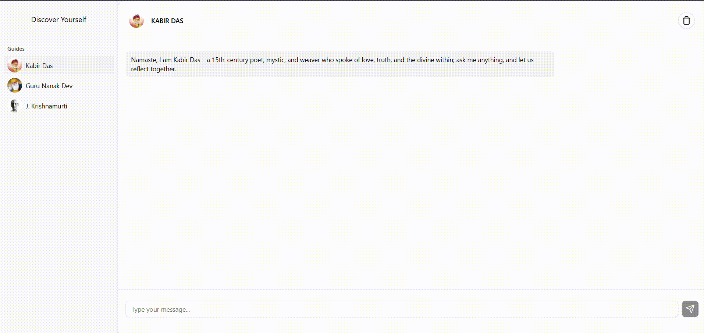

  
  
  
  

I enjoy writing code that solves real-world problems and motivated by the power of technology as a tool for positive change. I'm always eager to learn, grow, and contribute to projects that make a meaningful impact.

See [my website](https://rajatsinghportfolio.netlify.app/) for more information!

<h1 align="center">Projects</h1>
<table bordercolor="#66b2b2">
  
  <tr>
    <td width="50%" valign="top">
      <h3 align="center">Edu Papers</h3>
         
        
         
        

          
    
  
      

        
<strong>JavaScript, Tailwind, Node.js, & Express.js</strong> – A platform that helps students easily upload and access past exam papers. EduPapers simplifies exam preparation by making important study resources easily searchable and community-driven.

    </td>
    <td width="50%" valign="top">
      <h3 align="center">Discover Yourself AI</h3>
         
      
         
        

          
  
  
      

        
<strong>TypeScript, React, Node.js, & Gemini API</strong> – A unique conversational platform where users can interact with chatbots inspired by the philosophies of Kabir Das, Guru Nanak Dev, and Jiddu Krishnamurti. Discover Yourself AI offers thoughtful, perspective-driven dialogues.

    </td>
  </tr>
  
  <tr>
    <td width="50%" valign="top">
      <h3 align="center">My Portfolio</h3>
       
        
       
        

  
      

        
<strong>HTML5, CSS3, & Javascript</strong> - Portfolio Site including links to my projects and ways to get in contact with me.

    </td>
  </tr>
</table>

<h1 align="center">Technologies</h1>

    
    
    
    
    
    
    
    
    
    
    
    
    
    

---

<h1 align="center">Connect</h1>

  
  
  
  

